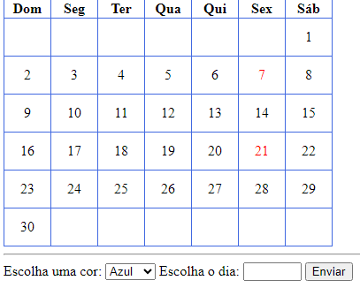

# calendario-trabalho

## Índice 
[Calendario](calendario)
[Descrição](#descriçao)  
[Introdução](#introdução)  
[Funcionalidades](#funcionalidades)  
[Tecnologias utilizadas](#tecnologias-utilizadas)  
[Fontes consultadas](#fontes-consultadas) 
[Autores](#autores)  

## Descrição
Foi uma atividade exercida em aula com o professor com foco de realizar um calendário.
## Introdução
Proposta de atividade  seria mudar a cor da data conforme escolhida.
## Funcionalidades
Foi criado em html uma página,que nela foi criado um calendário com função de escolha de cor e dia e ao ter sua opção de escolha clicar em enviar e colorir a data escolhida.

### Tecnologias utilizadas
* ``HTML``
* ``CSS``
* ``JAVA SCRIPT``
## Autores
Executado por Rayssa Rafaelly com orientação do Professor Leonardo Rocha.